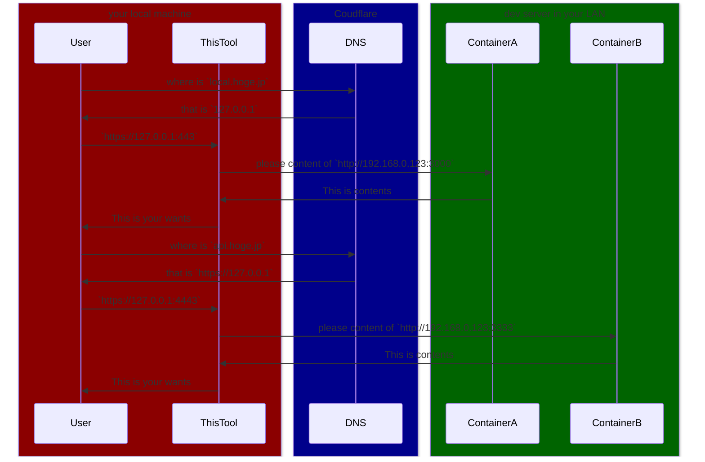

# LOCAL SSL DEVELOPMENT TOOL

## Description

There is an HTTP service running within the LAN, assigned to an arbitrary IP. I want to launch a Docker container that sets up an HTTPS proxy to this HTTP service using letsencrypt, certbot, cloudflare and nginx. I want to be able to access this from within the host machine where the proxy container is running, using <https://local.hoge.jp>.

- Utilize `docker compose`.
- The A record of `local.hoge.jp` is managed by Cloudflare DNS.
- The A record of `local.hoge.jp` should be fixed at `127.0.0.1`.
- Ensure the `certbot renew` command is executed periodically as configured.
- Allow the setting of `local.hoge.jp` and the LAN internal IP in the `.env` file.
- I want to obtain a "real HTTPS certificate"  using DNS authentication.
- "real HTTPS certificate" means that a certificate that can be verified with a certificate already in the certificate store
- Write the `DOMAIN` and `LAN_IP` in the `.env` file just once.

## Architecture



## Usage

Run `./start_docker.sh` to start the docker container.

## Config

### cloudflare config

Make your own `cloudflare.ini` file.

```text
dns_cloudflare_api_token = YOUR_API_TOKEN
```

### .env

Make your own `.env` file.

```text
DOMAIN=local.hoge.jp
LAN_IP=192.168.0.123:3000
DOMAIN2=api.hoge.jp
LAN_IP2=192.168.0.123:3333
EMAIL=your_cloudflare_account_email_address@email.jp
```

## Disclaimer

This tool is for local development only.
Do not use it in a production environment.
